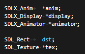
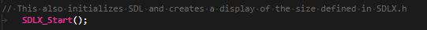
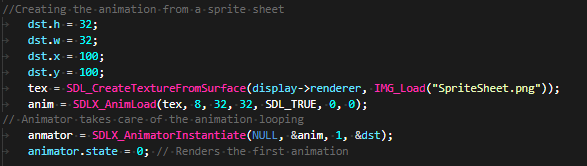
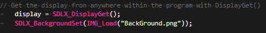
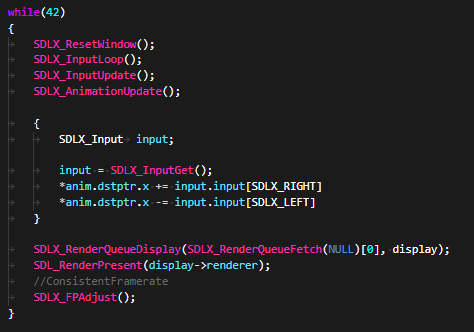

# SDL_Tools

Wrapper for the SDL library


### Table of Contents
**[Dependncies](#dependncies)**<br>
**[Contents](#contents)**<br>
**[Known Issues](#known-issues)**<br>
**[Usage](#usage)**<br>
**[Code example](#code-examples)**<br>
**[Upcomming features and fixes](#upcoming-features-and-fixes)**<br>


## Dependencies

This assumes that the SDL2 library header files are located in SDL2/ in your includes folder

This also uses SDL2_image, SDL2_ttf and SDL2_mixer

These are available on SDL2 websie, via brew or in this repository under Dev/includes/SDL2

## Contents

This library contains animations, input and display tools. - for now-


## Known issues

None so far. This program only contains features >:)


## Usage

```
git clone https://github.com/FlavorlessQuark/SDL_Tools/Release
copy the contents of the includes folder into your project's include directory
compile your project  with -L -l libSDLX.a
```

## Code examples

You want to use this but have no clue where to start? Here's a small program to display an animate dsprite that you can move left and right (in 42 lines of code, give or take some empty lines and your preffered methd of initalizing variables)

To start we are going to need a display to render things to, an animator, and some other things to fill our animator with (depending on your coding style you might or might not need to declare anim and texture);

<br><br>

After declaring our variable we initialize the library (don't worry, it also initializes SDL for you)

<br><br>

Now it's time to get out input setup. SDLX_InputMap puts all the input data you need in the same place

Here the A, Left Arrow and Left Controller arrow are all mapped to the same thing, letting you check all of them at once.

Gone are the days of endless if else statements.

<br><br>

Creating an animation is simple. Take a texture, call AnimLoad() with your parameters and you will have a fresh new animation; Then instantiate your animator with the animation (or set of animation).

<br><br>

`Disclaimer, this only works if your frames are neatly aligned in the same row. However you are free to create your own AnimLoad() function. Perhaps even open a pull request :) This one was just the most convenient for me."`


Sef explanatory. Get the display so we can start rendering. Set a background to be renderer before everything;

<br><br>

```
Our main loop it can seem dauting at first but it's very simple once you understand what it does;

First reset the window (this clears the window and draws a background)

Then poll the input (Here I use the default SDLX_InputLoop() which just quits the program when escape is pressed)

Update the input (This is where all the input mapping magic happens)

Update the animations

Get the updated input from SDLX_Input struct and use it to change the x coordinate of our sprite;

RenderQueues are the way SDLX displays images to the screen, think of it as layers that get renderer on top of one another;

Here we will render layer0 as this is the default one.

RenderPresent to render to the screen;

Then we do some magic to keep the framerate consistent
```
<br><br>

Done!


## Upcoming features and fixes

- Add Input remap

- Potential typos in this ReadMe

- Add animations to animator

- Maybe remove aniations from animator (would require animation ID)

- Add a render queue parameter to sprte and render accoringly

- Override options for render Q / animatiors and init functions (user might want to not use them at all or use their own rendering functions)

- UI things ~~ Interaction layers maybe

- Interaction layers? i.e : Something that goes through wall would check for collisions on every layer but the "walls" layer.