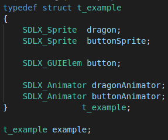
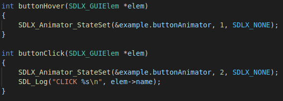
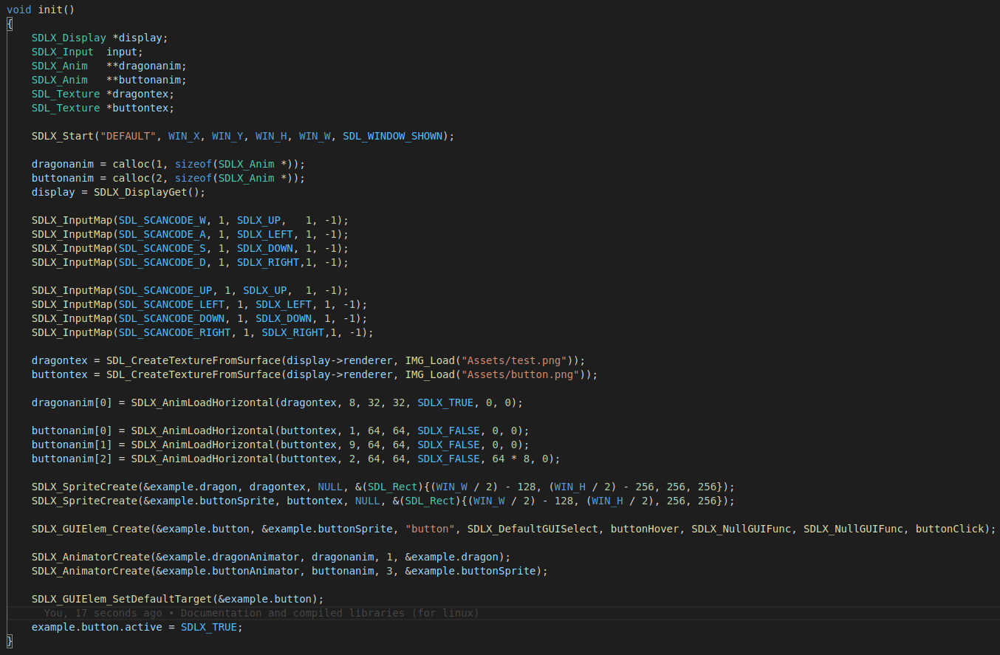
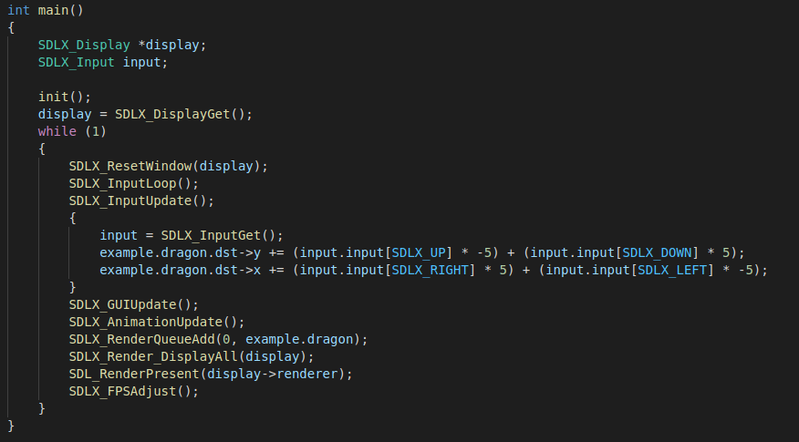

# SDL_Tools

Wrapper for the SDL2 library

**This is the old version, the new version is located at https://github.com/FlavorlessQuark/SDL_Tools**


### Table of Contents
**[Dependencies](#dependncies)**<br>
**[Contents](#contents)**<br>
**[Known Issues](#known-issues)**<br>
**[Usage](#usage)**<br>
**[Code example](#code-examples)**<br>
**[Upcomming features and fixes](#upcoming-features-and-fixes)**<br>

## Overview

This library currently supports animations, buttons, input collisions and rendering.

## Dependencies

This assumes that the SDL2 library header files(along with SDL_image, SDL_ttf, and SDL_mixer) are located in SDL2/ in your includes folder

These are available on SDL2 website, via your package manager or in this repository under includes/SDL2

## Get started

To use this library you will need the SDL2 headers in your includes/ folder, and you will need to compile either with the libsdlx.a or libsdlx.so binary

Currently, only the .a and .so for Linux are available. If you are using another OS, you will need to compile those by hand or compile with the source code. To compile the .a and .so files, you must do the following: 

```
git git@github.com:FlavorlessQuark/old_SDL_Tools.git
cd old_SDL_Tools
make dynamic
make static
```

## Code example

**The assets used in this example were made by me. If you wish to use them, ask for permission first :)**

In this example, you will learn how to use the rendering, animator, input mapping and GUI components of SDLX

<br><br>
<br><br>
<br><br>
<br><br>

## Rendering

## Input

## GUI

## Collisions

